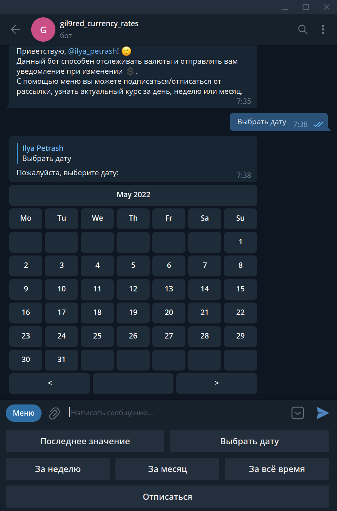

# Бот для отслеживания курсов валют
Данный бот способен отслеживать валюты и отправлять вам уведомление при изменении.
С помощью меню вы можете:
 * Подписаться/отписаться от рассылки.
 * Узнать актуальный курс за день, неделю, месяц, за всё время или за конкретную дату.

# Установка
Для данного бота требуются библиотеки из [requirements.txt](requirements.txt)

# Скриншоты
|                                    |                                                                                                                                              |
|-------------------------------------------------------------------------------------------|----------------------------------------------------------------------------------------------------------------------------------------------|
| Выбор даты:  | Выбор даты:                                                     |
| За неделю:             | За месяц:                                                                   |
| За всё время:    | Посмотреть за определенный год:  |
| Настройки:                  | Просмотр справки по валютам:          |
